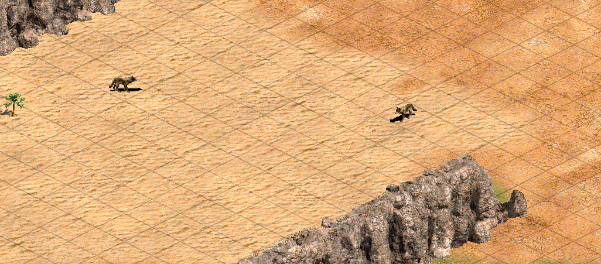
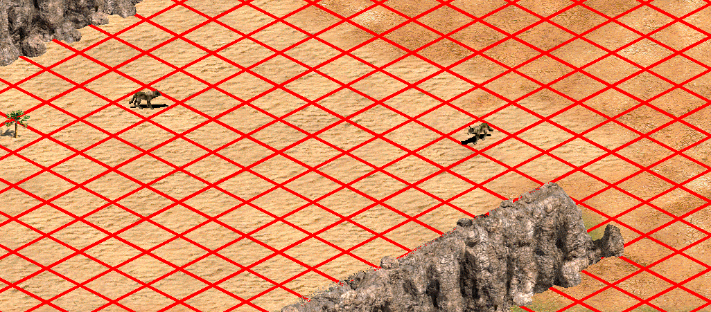

# Description
Adding grid lines to the ground textures in AoE2 helps placing buildings and judging distance. A popular mod on the Steam Workshop providing this is [Alignment Grid](http://steamcommunity.com/sharedfiles/filedetails/?id=176712202).

However different mods modifying the same ground texture are not compatible and one has to take priority over the other. If a player wants to use a custom terrain which does not come with a grid they need to bug the author to make another version. On the other hand all mod authors that want to provide a grid need to go through the same manual process.

This project aims to solve both problems by adding grid lines to any existing mod or the base game in an automatic fashion. Players can add a grid to any terrain mod on their own and mod authors have to do less work if they do want to provide a grid in their mods.

Additionally the look of the grid is customizable with the defaults closely resembling the previously linked Alignment Grid mod.

This readme is written with the HD version in mind but should work with the original as well by moving folders around manually. Since I do not have the original I am not sure about the exact steps.

# Installation
To run the python source [Python 3](https://www.python.org/) and [Pillow](http://pillow.readthedocs.io/en/latest/installation.html) are needed. Alternatively a stand-alone executable can be found under [Releases](https://github.com/e00E/Age-of-Empires-II-Grid-Generator/releases) here on Github.

# Usage
This is a command line application without graphical user interface. Running it with `--help` gives a description of all the arguments.

After running the application a new mod called `Grid Generator` will appear in the `Steam Workshop` menu in the game. This mod contains the generated grid terrain. Make sure it has a higher priority than the other terrain altering mods.

## Arguments
* `--game-dir`Always needs to be provided. This is the installation directory of AoE2. To find this right click on the game in steam and select `properties` -> `local files` -> `browse local files`.
* `--mod-dir` Installation directory of an existing mod to which the grid will be added to. To find this open the `Steam Workshop` menu in the game, select the mod and click on `Open Directory`.
* `--alpha` The opacity of the grid lines as a number between 0 and 1 where 1 is totally opaque and 0 is totally transparent (invisible).
* `--width` The width of the grid lines in pixels.
* `--color` The color of the grid lines in RGB format.
* `--preview` Show a rough preview of the grid without creating any files.
* `--clean` Clean the installation directory before creating new files. This will remove all `.png` files in the directory. Existing files will still be overwritten even if the option is not given.

## Examples
Add the default grid to a mod:
```
grid_generator --game-dir "C:\Program Files (x86)\Steam\steamapps\common\Age2HD" --mod-dir "C:\Program Files (x86)\Steam\steamapps\workshop\content\221380\176712202"
```

Create a custom grid using the base game as the source terrain:
```
grid_generator --game-dir "C:\Program Files (x86)\Steam\steamapps\common\Age2HD" --alpha 1.0 --width 5 --color 255 0 0
```

